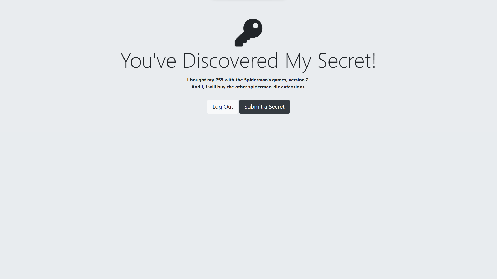

# Authentication Project.

The Authentication project was built using EJS, Node, Express and MongoDB. 
The purpose of this project is to implement a sign in web application where each user must be registered in this app in order to have completely access.

## Node packages.

If you want to run this web application in local, you should run and install this packages.

1. Initialize NPM: `npm init`.
2. Install Express JS: `npm install ejs`.
3. Install Body-Parser: `npm install body-parser`.
4. Install Nodemon: `npm install nodemon`.
5. Install Mongoose: `npm install mongoose`.
6. Install Mongoose-Encryption: `npm install mongoose-encryption`. <--- This was deleted further in the application.
7. Install Dotenv: `npm install dotenv --save`.
8. Install BycriptJS: `npm install bcryptjs`. <--- This was deleted further in the application.
9. Install Passport: `npm install passport`.
10. Install Passport Local: `npm install passport-local`.
11. Install Passport Local Mongoose: `npm install passport-local-mongoose`.
12. Install Express Sesion: `npm install express-session`.
13. Install Passport Google Oauth: `npm install passport-google-oauth20`.
14. Install Mongoose FingOrCreate: `npm install mongoose-findorcreate`.

## Authentication with Google

In order to authenticate using Google, we should install some packages and create our web application
in the Google Cloud Console.
* Create the project.
* Go to the **OAuth consent screen** and add the configuration for this project (select external).
* Create credentials, the web application and download your secrets keys.

For reference: 

* Javascript auth: http://localhost:3000
* URI auth: http://localhost:3000/auth/google/secrets

Once you've done that, add the neccesary configuration within your app.js and include the urls that you have specified.

## Web application.

In the section below, you can find images about this web aaplication in production.

.

.

.

## Author

* Jorge Ortiz
* jorge.ortiz@icalialabs.com
* Software engineer.
* San Luis Potosí, S.L.P. México.
